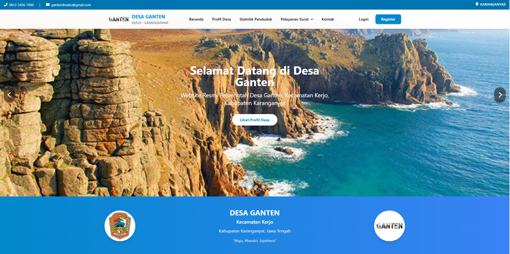

# Sistem Pelayanan Desa Ganten

Sistem pelayanan digital untuk pengelolaan surat keterangan di Desa Ganten, Kecamatan Kerjo, Kabupaten Karanganyar. Dibangun menggunakan Laravel dengan fitur admin panel, dashboard pengguna, cetak PDF, statistik kependudukan, dan rekap surat keluar.



## Fitur

- **10 Jenis Surat** — Domisili, Tidak Mampu, Belum Menikah, Kematian, Usaha, SKCK, KTP, Kelahiran, KK, Kehilangan
- **Panel Admin** — Dashboard, manajemen surat, approval workflow, kelola data statistik, user management
- **Dashboard User** — Pengajuan surat online, tracking status, download PDF
- **Statistik Kependudukan** — Visualisasi data pekerjaan, umur, pendidikan, dan wilayah dengan Chart.js
- **Rekap Surat Keluar** — CRUD lengkap, sinkronisasi otomatis dari tabel surat, halaman publik untuk transparansi
- **Responsive** — Tampilan optimal di desktop dan mobile

## Tech Stack

| Layer | Teknologi |
|-------|-----------|
| Backend | Laravel 10, PHP 8.1+ |
| Database | SQLite / MySQL |
| Frontend | Blade, Tailwind CSS, Alpine.js |
| Charts | Chart.js |
| PDF | DomPDF |

## Instalasi

```bash
# Clone repo
git clone https://github.com/rigel-sayudha/desaganten.git
cd desaganten

# Install dependencies
composer install
npm install

# Setup environment
cp .env.example .env
php artisan key:generate

# Konfigurasi database di file .env, lalu:
php artisan migrate
php artisan db:seed

# Build assets & jalankan
npm run build
php artisan serve
```

Buka `http://localhost:8000` di browser.

## Login Default

| Role | Email | Password |
|------|-------|----------|
| Admin | admin@desa.com | password |
| User | Register di `/register` | — |

## Struktur URL

**Admin:**
- `/admin` — Dashboard
- `/admin/statistik/pekerjaan` — Kelola statistik pekerjaan
- `/admin/statistik/umur` — Kelola statistik umur
- `/admin/statistik/pendidikan` — Kelola statistik pendidikan
- `/admin/laporan/rekap-surat-keluar` — Kelola rekap surat

**Publik:**
- `/statistik` — Grafik statistik kependudukan
- `/rekap-surat-keluar` — Rekap surat keluar

## Lisensi

[MIT License](LICENSE)
